# 🌱 E-MetricX

> **AI-powered carbon accounting and net-zero simulation platform for Indian coal mines.**


---

## 📖 Overview

E-MetricX is a full-stack web application developed to help coal mining industries monitor, analyze, and reduce their carbon footprint.

The platform automates carbon accounting by processing operational mine data, estimating greenhouse gas emissions, calculating carbon sinks, identifying neutrality gaps, and providing AI-assisted insights to support sustainable decision-making.

Unlike conventional spreadsheet-based reporting systems, E-MetricX integrates data management, analytics, visualization, forecasting, and reporting into a single platform.

---

## 🌍 Problem Statement

Coal mining operations generate significant greenhouse gas emissions through:

- Diesel-powered heavy equipment
- Electricity consumption
- Methane emissions
- Blasting operations
- Material transportation

Many organizations still rely on fragmented spreadsheets and manual reporting, making carbon accounting slow, error-prone, and difficult to analyze.

---

## 💡 Solution

E-MetricX provides a centralized platform that enables organizations to:

- Upload operational datasets
- Calculate carbon emissions
- Estimate carbon sinks
- Measure net carbon gap
- Compare multi-year performance
- Forecast future trends
- Support net-zero planning
- Generate analytical reports

---

## ✨ Key Features

- Secure user authentication
- Mine profile management
- Dataset upload & validation
- Scope 1 & Scope 2 emission calculation
- Carbon sink estimation
- Net carbon gap analysis
- Multi-year comparison dashboard
- AI-assisted emission forecasting
- Interactive charts & analytics
- Report generation

---

## 🛠️ Tech Stack

### Frontend

- React
- HTML
- CSS
- JavaScript

### Backend

- Flask
- Python

### Database

- SQLite

### Libraries

- Pandas
- NumPy
- Matplotlib

---


## 🏗️ System Architecture

<p align="center">
  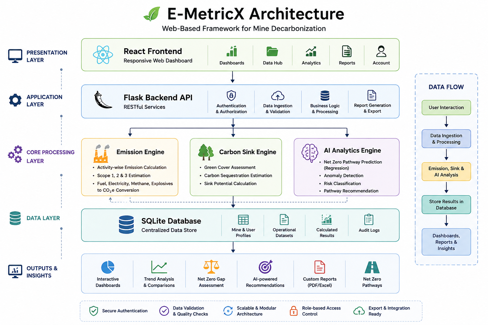
</p>


# 📸 Application Screenshots

## 🏠 Landing Page

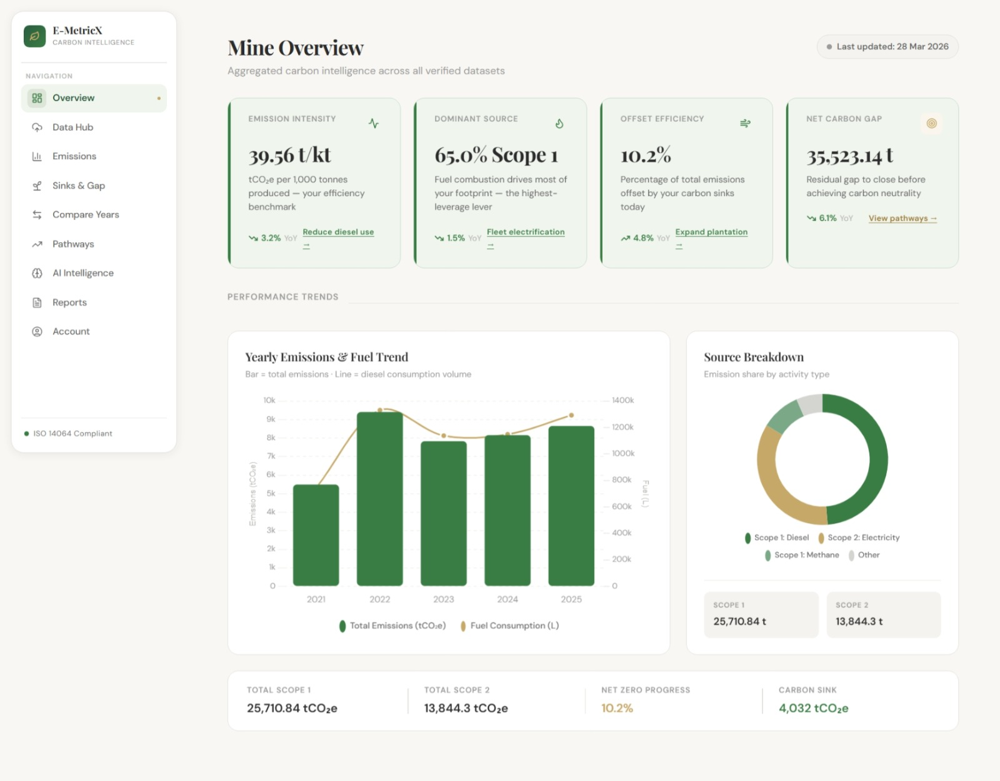

---

## 📊 Dashboard

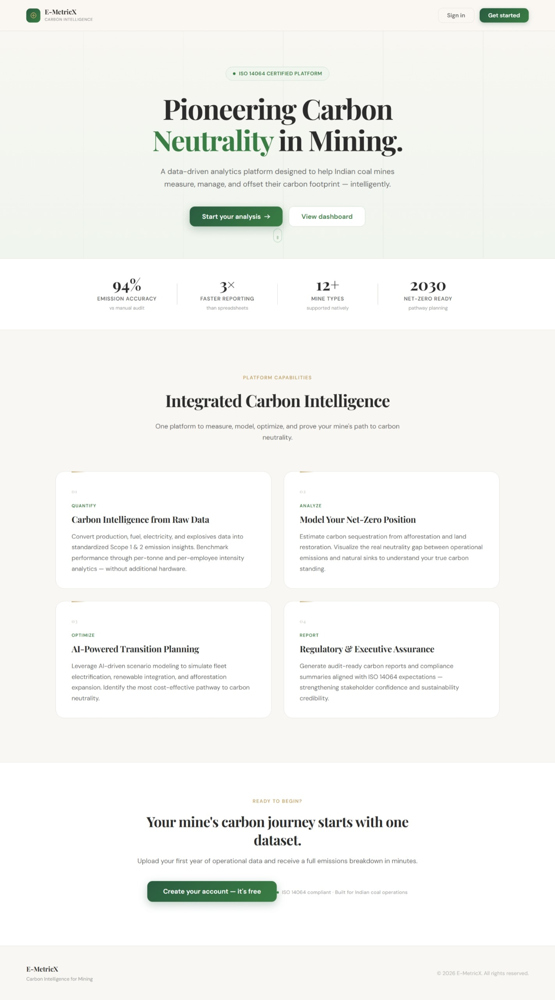

---

## 📂 Data Hub

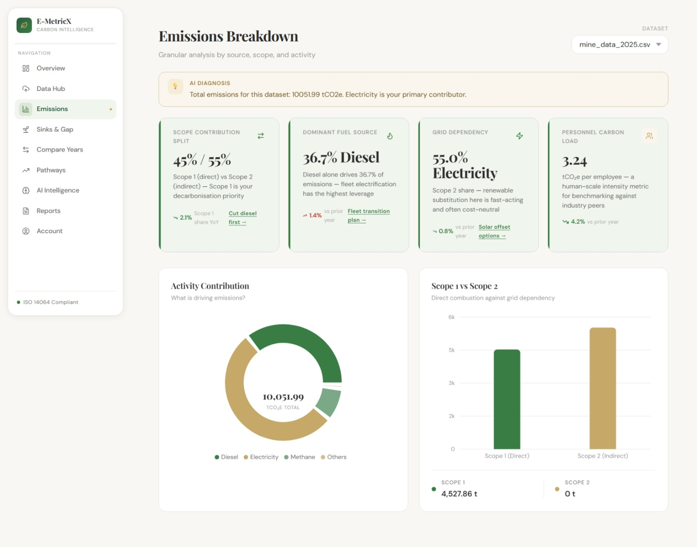

---

## 📈 Carbon Emissions Analysis

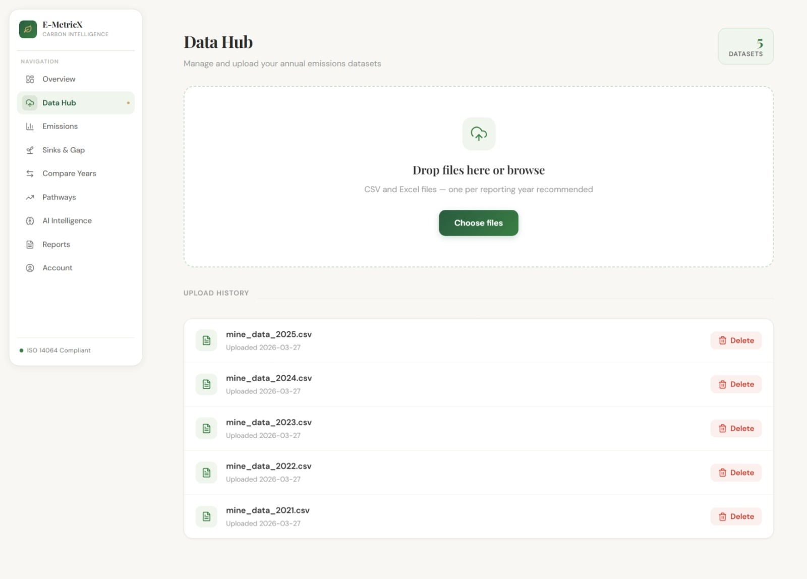

---

## 🌳 Carbon Sink & Neutrality Gap

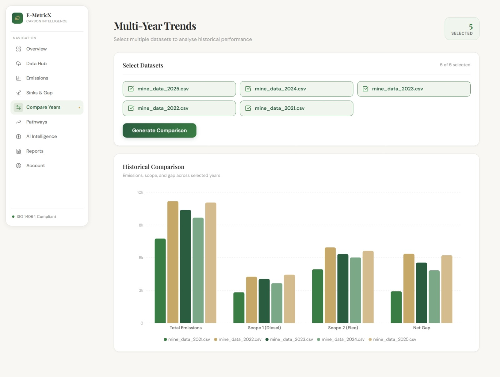

---

## 📅 Year Comparison

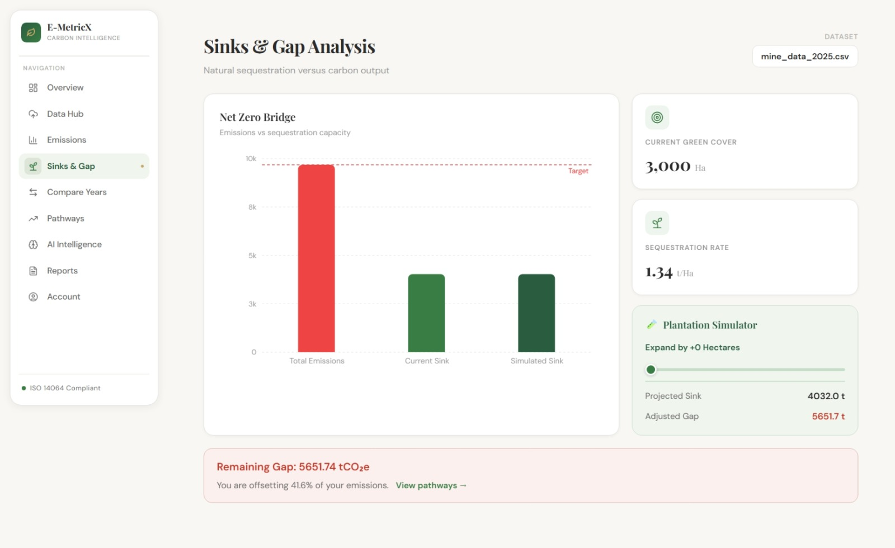

---

## 🤖 AI Intelligence

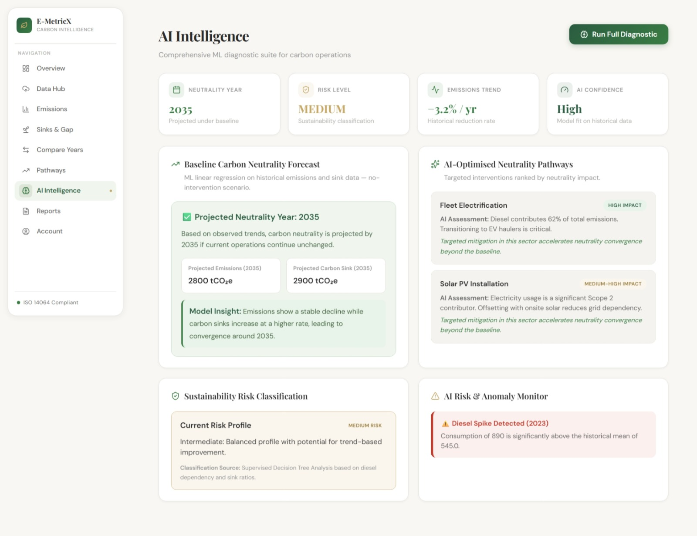

---

## 🛣️ Net Zero Pathways

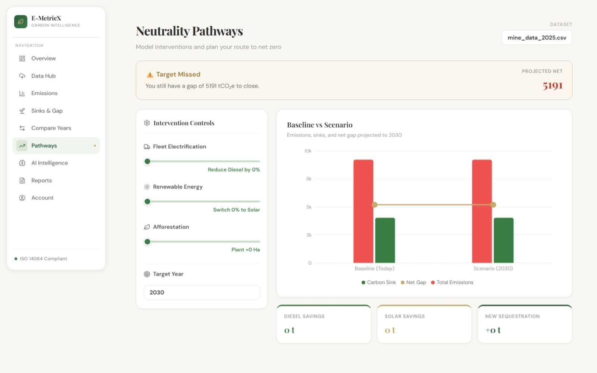

---

## 📄 Reports

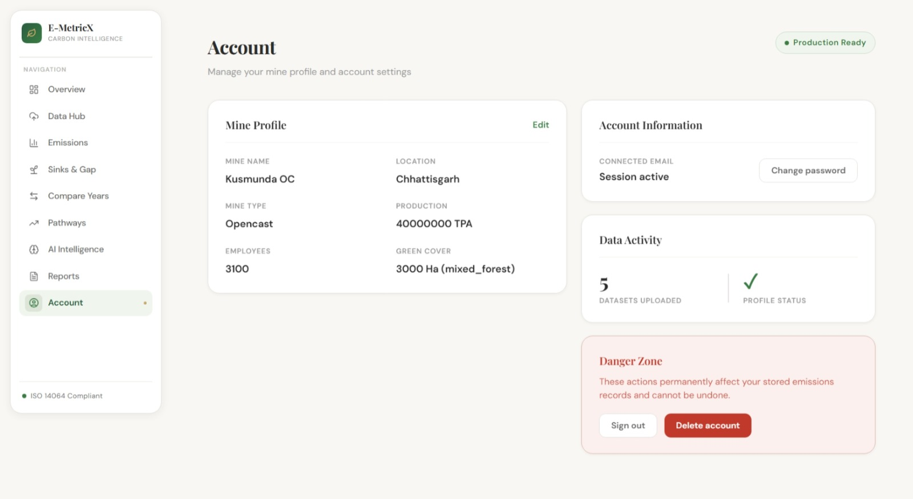

---

## 👤 Account Settings


---

## 📝 Audit Report

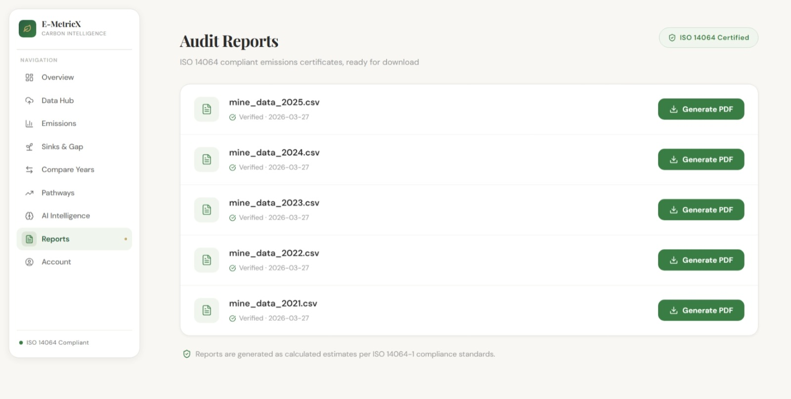
## 📂 Project Structure

```
E-MetricX
│
├── backend
├── frontend
├── README.md
├── package.json
└── .gitignore
```

---

## 🚀 Future Enhancements

- Real-time IoT integration
- Satellite vegetation analysis
- Advanced machine learning models
- Cloud deployment
- Multi-mine management
- Automated ESG reporting

---

## 👩‍💻 Team Project

Developed as a Final Year Engineering Project.

### My Contributions

- Backend development
- API integration
- Carbon emission analytics
- Dashboard implementation
- Testing and debugging
- Documentation

---

## 📜 License

This project is intended for academic and educational purposes.

---

## © Copyright

© 2026 Krishita K K. All Rights Reserved.

This repository is shared solely for portfolio and evaluation purposes.

No part of this source code may be copied, modified, redistributed, or used in other projects without prior written permission from the author.

